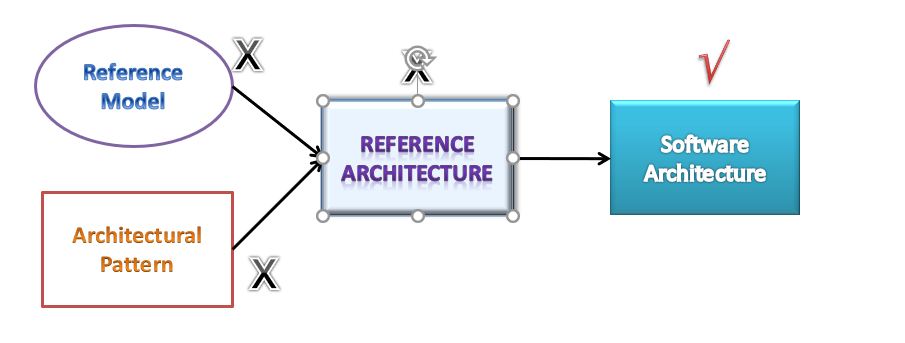

# Software Architecture 

## Modules 1 (Pre-recorded)

### What is Software Architecture

Software architecture is the blueprint of building software. Blueprint of a software system that helps stakeholders to understand how the system would be once it is implemented 

Description in details,
A description at a higher level of abstraction than objects and lines of codes 
So that Stakeholders understand and reason about without getting lost into a sea of details

### Who is Stakeholders

Software architecture is not necessary to say yes to all area of concern, but he should ready with answer for all to stakeholders must agree

### Why Architecture needs to be described

1. Each stakeholder has his own interpretation of the systems
Sometimes no understanding at all
Architect is the middleman who co-ordinates with these stakeholders
2. How will everyone be convinced that his expectations from the system will be satisfied?
3. Even when the architect has created the solution blueprint, how does she handover the solution to the developers?
4. How do the developers build and ensure critical aspects of the system?
5. Misunderstanding leads to incorrect implementation
Leads to 10 times more effort to fix at a later stage

### Definitions of Software Architecture

### Architecture Styles

Architecture style first proposed by Shaw and Garlan– synonymous to “architecture pattern”
* A set of element types (what the element does- data store, compute linear regression function)
  <i>Note: </i> Element A is storing data and Element B might do some business logic
* A set of interaction types (function call, publish-subscribe)
  <i>Note: </i> Interaction types means how this elements are interacting with each other 
  <i>Note: </i> Interaction will be in lines, like data flow, publish-subscribe architecture, etc)
* Topology indicating interactions and interaction types
  <i>Note: </i> topology means the way it is connected
* Constraints
  <i>Note: </i>Constraints is like what is allowed and not allowed 
* Also known as architectural pattern

### Architectural Views and Architectural Structure

* Since architecture serves as a vehicle for communication among stakeholders
    * And each stakeholder is interested about different aspects of the system
    * It is too complex to describe, understand and analyze the architecture using one common vocabulary for all stakeholders
        * Essentially it needs to be described in a multi-dimensional manner
  <i>Note: </i> Stackholder could be CTO, developer, DB, etc each is interested in there aspect like CTO - Standard and policy, cyber security, DB - storing data, so it is describe in multi-dimensional manner
  <i>Note: </i> Software architecture it needs to described in a multi-dimensional manner so each dimension is essentially called as view

* View based approach
    * Each view represents certain architectural aspects of the system, created for a stakeholder
    * All the views combined together form the consistent whole
  <i>Note: </i> The way we describe View is by Structure

* A Structure is the underlying part of a view- essentially the set of elements, and their properties
    * A view corresponding to a structure is created by using these elements and their inter-relationships
  <i>Note: </i> Structure means boxes, lines, images and so on (which helps to create to block diagram). Views is those we create by this Structure

### Reference Model and Reference Architecture

* A reference model 
    * Decomposes the functionality into a set of smaller units
    * How they interact and share data
    * These units co-operatively implement the total functionality
* A reference architecture
    * Derived from the reference model
    * Concrete software elements, mapped to the units of the reference model, that implement the functionality
  <i>Note: </i> a reference architecture is an example solution using that set of reference models

  <i>Note: </i> 
* Reference model - is abstract and belongs to particular domain 
* Combination of reference model and Architecture pattern is Reference Architecture
* eg: Reference Architecture - Mobile commerence platform i.e., set of elements interactions and those elements basically would describe what are the typical functionalities but will really not address all the quality of service concerns but it will tell you that what are the essential components that are required
* software architecture - is essentially created from a reference architecture that's a specific instance of reference architecture there you instant hit each element with real modules that are going to be implemented and you address a lot of other concerns, you add lot more details and that makes it that makes it a software architecture, so it is basically an actual software system that is derived from the blue from the requirement so you know this one is essentially created from the requirement
* Architecture Pattern - is dealing with more of non-functional
* reference model and reference architecture deals with the functional aspects 
* software architecture - if Airtel phone or any other company they basically uses this reference architecture and builds their own platform then it becomes a software architecture
* Software architecture - blueprint that is derived from the requirement is the software architecture it contains design decisions
* reference architecture - really does not have any design decisions taken

### Benefits of Software Architecture

1. Every stakeholder should understand “unambiguously” what the blueprint is 
* Standard approach, vocabulary, output
* Common language for communication

  <i>Note: </i> this particular benefit is something that makes a huge difference in our large corporation every stakeholder understands unambiguously what the blueprint is so that means there is a complete standardization of the approach vocabulary and the output that means everybody understands what the other group is doing and there is a common language for communication across different stakeholders that definitely helps in streamlining the work

2. Streamlining work assignments for multiple teams
* Avoiding information loss, enforcing traceability

  <i>Note: </i> who is doing what what what time they're finishing is a misunderstanding of what is expected so so all these things are a huge overhead in terms of with respect to implementing a software and oftentimes the project teams really do not estimate such overheads they they don't even consider that they assume that everything is going will go on fine and they just compute the estimates based on the complexity of the software the function points and so on but this streamlining part is a real challenge and that never are hardly considered so architecture actually helps in streamlining things and it can avoid information loss it can avoid such ambiguity and it can enforce the traceability that what are the requirements that were considered whatare not considered if they're considered where it has been considered

3. Early analysis of meeting quality requirements and compromise between different QoS requirements
* Early prototyping of important aspects quickly
* Design decisions are made early
* Quicker to evaluate these decisions and correct it rather than discovering it later (10 – 100 times more costly)
* Early analysis of QoS and evaluation of architecture
* More accurate cost and schedule estimation

  <i>Note: </i> 
If decisions are not made early or not evaluated or corrected later on oftentimes there are problems and there are rework so it is. At the architecture level because it is at a high level it is quicker to evaluate these these decisions and actually correct it rather than discovering it late. as it takes 10 to 100 times more effort if it is discovered during testing or during deployment, it can be a disaster all the analysis of quality of service and evaluation of architecture is possible.  If software architecture creates properly all the analysis of meeting the quality requirements and different compromises are also possible to analyze, because not every quality of aspects can be really met sometimes they become the contradict each other, so one needs to really assess that what are the contradictory requirements and how one has to choose. The best place to analyze and decide such kind of contradictory requirement is at the level of software architecture it really shouldn't be done they at a later stage it should be done only at the architecture stage.

  <i>Note: </i> 
streamlining of work assignments becomes a major problem that can actually make all this cost unskilled estimates to go here where things become wrong and in fact it becomes a major major overrun 

4. Improve speed of development 
* Reuse
    * Helps in building a large product line faster by sharing common architecture
    * From one implementation to another similar implementation
* Based on the architecture, one can quickly decide build-vs –use external components
* Tool that can automate part of development, testing

  <i>Note: </i> 
Improves the speed of development in fact if in a large organization if reuse is is to be promoted and reuse is a buzzword or reuse is a mantra that many corporations use they really reuse the artifacts generated by one project team in another, so essentially that's possible only if one does software architecture properly
  <i>Note: </i> 
then tools that can automate part of development and testing that also can be used in fact there are tools 

### Three Structures

1. Module Structure
How is the system to be structured as a set of code units (modules)?

2. Component-and-connector structures
How is the system to be structured as a set of elements that have runtime behavior (components) and interactions (connectors)
What are major executing components and how do they interact
  <i>Note: </i> 
Components might be shared library, executable files, or webservices

3. Allocation structures
How is the system to relate to non-software structures in it’s environment (CPU or cluster of CPUs, File Systems, Networks, Development Teams …)
  <i>Note: </i> 
Software system is connected to environments like CPU system is going to deploy it on what machines how many machines how the data is going to be stored in different file system how the communication is actually happening through the networks

### Summary

